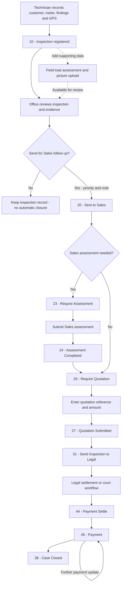
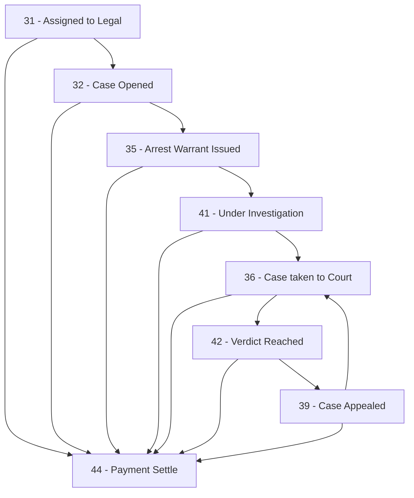

# JEDCO Inspection Process Flow

**Review date:** 30 September 2026

**Basis:** Current source code in the inspection backend, inspection administration web app, Sales web app, Legal web app, and Field Ops mobile app.

This document describes how an inspection moves from field registration through review, Sales assessment and quotation, Legal follow-up, payment tracking, and case closure. It replaces the old document as a description of the implemented workflow. Physical meter handling and activities in external systems are identified separately.

This is a source-code review, not verification of a running deployment. Status names in database-backed lists may differ from the button labels below. The numeric status IDs and available UI actions are the basis for the flow. The source projects were reviewed directly; bundled frontend files in the backend may represent different build versions.

## 1. Participants and applications

| Participant | Application | Responsibility in this workflow |
| --- | --- | --- |
| Field inspection technician | `jedco-field-ops`, Inspection module | Look up the customer, record inspection findings and location, submit a load assessment, and upload a picture. |
| Inspection team leader or authorized office user | `jedco-inspection-web` | Review and correct the inspection record, inspect supporting evidence, and send the case to Sales with a priority and note. |
| Sales and Marketing user | `jedco-inspection-sales` | Request and submit a Sales assessment where needed, record a quotation, send the case to Legal, track payment, and close the case. |
| Legal user | `jedco-inspection-legal` | Record settlement or legal proceedings, maintain the case number, and return the case to the payment stage. |
| Inspection backend | `jedco-inspection-spring` | Store inspections, assessments, quotations, assignments, statuses, evidence, and history; expose the shared APIs. |

These are operational responsibilities, not a claim that the backend enforces a separate role for every step. The applications use authentication and authority checks, but the generic Sales and Legal status-update endpoints do not enforce the complete transition sequence shown here.

The CMS and Engineering modules in Field Ops serve separate workflows. Inspection uses Engineering feeder and transformer lookups. No automatic inspection-to-CMS dispatch or meter-reinstallation handoff was found in the reviewed inspection flow.

## 2. End-to-end flow

The diagram shows the actions available through the current interfaces. Supporting load assessments and pictures are submitted separately after inspection registration; the code does not make them prerequisites for sending a case to Sales.

The decision to send an inspection to Sales is an office action. Problem types do not automatically route a record. A finding described operationally as “no issue” does not automatically close the inspection in the reviewed code.

## 3. Detailed operating process

### Step 1 — Register the field inspection

**Owner:** Field inspection technician

**Application:** Field Ops → Inspection

1. Select the Inspection application and sign in. The home screen loads the signed-in user's inspections for the selected date, initially today.
2. Open the registration form. Where a meter is available, check the customer by meter number and review purchase history. The current registration screen uses the inspection database customer lookup; a separate Conlog confirmation API exists but is not the lookup used by this screen.
3. Capture or confirm customer name, phone number, meter number, meter type, CIU number, connection type, tariff category, CT ratio, feeder, transformer, and location as applicable.
4. Select one or more problem types. The app loads the associated inspection codes and filters them by meter type. Complete the checklist and applicable code results, and add remarks.
5. Capture GPS latitude, longitude, and accuracy, then submit the inspection.

The mobile controller checks for customer name, phone number, feeder, transformer, connection type, location, GPS, at least one problem type, and checklist rows. Unless **Direct Connection** is selected, it also requires a customer-status value, meter type, and meter number. The customer-status check tests whether a value is present; it is not a strict guarantee that customer lookup succeeded.

**System result:** The backend creates the inspection at status **10**, saves checklist and code results, and requests an `INSPECTION REGISTERED` history entry. Multiple selected problem types are stored as comma-separated text.

**Data availability:** The mobile app submits directly to the backend. Web users see stored data when their list is loaded or refreshed. No Inspection-module offline submission queue or live push synchronization was found.

### Step 2 — Add the field load assessment and picture

**Owner:** Field inspection technician

**Application:** Field Ops → existing inspection card

The technician can perform two separate actions:

| Action | Data recorded | Effect on process status |
| --- | --- | --- |
| Register Assessment | Customer type, presented document, reason, and equipment rows containing power rate, quantity, and `totalKwh`. Reasons offered are Inspection and Reconnection. | Creates a field load assessment; does not change the inspection's workflow status. |
| Upload Picture | An image selected from the camera or gallery and linked to the inspection. | Adds inspection evidence; does not change the workflow status. |

After these records exist, the mobile card displays **Assessment Submitted** and **Picture Uploaded** in place of the corresponding actions. The field load assessment is different from the Sales assessment in Step 4. The “Reconnection” reason is an assessment classification; it does not create a reconnection work order.

The backend stores the submitted load values. Quotation references and amounts are entered manually by Sales as described in Step 5.

### Step 3 — Review and send to Sales

**Owner:** Inspection team leader or authorized office user

**Application:** Inspection administration web app

1. Find the record using the inspection list and its date, customer, meter, phone, status, or problem-type filters.
2. Review customer information, checklist, code results, load assessment, remarks, pictures, and history. The administration interface provides editing dialogs for customer information and problem types, checklist results, code results, load assessment, and remarks.
3. For a record at status **10**, select **Send to Sales**.
4. Select **High**, **Medium**, or **Low** priority and provide a handoff note as appropriate.

**System action:** Create a Sales assignment containing the inspection, priority, sender, sent date, and note; set the inspection status to **20 — Sent to Sales**; request an `INSPECTION SENT TO SALES` history entry.

This is a departmental handoff. The dialog does not select an individual Sales officer. No distinct Sales acceptance action is exposed in the current Sales workflow.

**Persistence qualification:** `sendToSales` saves the assignment and changes the inspection object, but does not explicitly save that inspection or declare a service transaction. The intended `10 → 20` handoff should be checked in a configured development environment; its persistence was not established by this documentation review.

### Step 4 — Complete a Sales assessment if required

**Owner:** Sales and Marketing user

**Application:** Sales web app

At **20 — Sent to Sales**, choose one of two actions:

- **Require Assessment** → status **23**.
- **Require Quotation** → status **26**, skipping the Sales assessment.

At status **23**, **Submit Assessment** records transformer number, distance, northing, easting, an optional note, and optional attachments. The UI requires the four assessment fields before submission.

**System result:** A Sales assessment is stored, an assessment history entry is requested, and the inspection moves to **24 — Assessment Completed**. Sales then selects **Require Quotation** to move to **26**.

### Step 5 — Record the quotation and hand over to Legal

**Owner:** Sales and Marketing user

**Application:** Sales web app

1. At **26 — Require Quotation**, select **Submit Quotation**.
2. Enter the quotation reference and amount, with a note and attachments if needed. The UI requires a reference and amount.
3. Submit the quotation. The backend stores the quotation against the inspection and sets status **27 — Quotation Submitted**.
4. Select **Send Inspection to Legal** to set status **31**.

Quotation preparation takes place outside the implemented submission flow. Selecting **Require Quotation** changes the status. The Sales user then manually enters the quotation reference and amount for the system to record.

### Step 6 — Handle settlement or legal proceedings

**Owner:** Legal user

**Application:** Legal web app

Legal reviews the inspection and supporting records. The interface includes a printable legal handover letter, as well as checklist, code-list, assessment, picture, and history views.

At status **31**, Legal can record **Payment Settle** immediately or open a case. Opening a case requires a **legal case number** in both the UI and backend validation. Legal updates can include notes and supporting files.

These statuses record updates entered by Legal staff. They do not electronically issue warrants, file court proceedings, or obtain court decisions. Customer contact and the underlying legal actions occur outside this application.

### Step 7 — Track payment and close the case

**Owner:** Sales and Marketing user

**Application:** Sales web app

1. When Legal records **44 — Payment Settle**, Sales selects **Payment**, moving the inspection to **45**.
2. At **45**, Sales can select **Payment** again to add another status update, note, or attachment.
3. Sales selects **Case Closed** to move the inspection to **38**.

The implemented payment action is a status update. It does not record structured payment amounts, receipt numbers, or balances. Payment collection and reconciliation must therefore be handled through the applicable external business process; notes and attachments can support the inspection history.

Status **38** is the end of the available UI transition flow. No reopening action or subsequent meter-installation completion step was found in these inspection interfaces. The status-update service does not populate the inspection's `completedOn` field when closing a case, so a closure timestamp should not be inferred from that field; the closure history records the action date if saved successfully.

### Step 8 — Coordinate any physical meter work externally

The old document describes disconnecting and storing a meter, releasing it after settlement, assigning an operations team, and reinstalling it. These activities may remain operational requirements, but the reviewed inspection code does not provide a dedicated meter custody register, release approval, operations assignment, or installation confirmation linked to case closure.

The implemented sequence closes the case in Sales. It does not verify that physical reinstallation has occurred. Any operational requirement to reinstall before closure needs a separate procedure or an application change.

## 4. Status transition reference

Labels below follow the current interface actions and source comments. They are not a complete export of the database status catalog.

| Current status | Action | Next status | Actor |
| --- | --- | --- | --- |
| New inspection | Submit field inspection | 10 — Registered | Technician |
| 10 | Send to Sales, with priority and note | 20 — Sent to Sales | Inspection office |
| 20 | Require Assessment | 23 — Require Assessment | Sales |
| 20 | Require Quotation | 26 — Require Quotation | Sales |
| 23 | Submit Sales assessment | 24 — Assessment Completed | Sales |
| 24 | Require Quotation | 26 — Require Quotation | Sales |
| 26 | Submit quotation | 27 — Quotation Submitted | Sales |
| 27 | Send Inspection to Legal | 31 — Assigned to Legal | Sales |
| 31 | Case Opened, with legal case number | 32 — Case Opened | Legal |
| 32 | Arrest Warrant Issued | 35 — Arrest Warrant Issued | Legal |
| 35 | Under Investigation | 41 — Under Investigation | Legal |
| 41 | Case taken to Court | 36 — Case taken to Court | Legal |
| 36 | Verdict Reached | 42 — Verdict Reached | Legal |
| 42 | Case Appealed | 39 — Case Appealed | Legal |
| 39 | Case taken to Court | 36 — Case taken to Court | Legal |
| 31, 32, 35, 41, 36, 42, or 39 | Payment Settle | 44 — Payment Settle | Legal |
| 44 | Payment | 45 — Payment | Sales |
| 45 | Payment, with another update | 45 — Payment | Sales |
| 45 | Case Closed | 38 — Case Closed | Sales |

The Sales and Legal services validate that the inspection, user, and requested status exist; Legal additionally requires the case number for status 32. They do not validate that the previous status permits the requested next status. Consequently, this table describes the guided UI workflow, not a strictly enforced backend state machine.

## 5. Shared visibility and supporting records

### Work lists

- **Mobile Inspection:** inspections registered by the logged-in user within the selected dates, excluding deleted status 3.
- **Inspection administration:** broader inspection review with filters, pagination, editing, printing, and Excel export.
- **Sales:** inspection status ID **greater than or equal to 20**, subject to the selected filters.
- **Legal:** inspection status ID **greater than or equal to 30**, subject to the selected filters.

Sales and Legal lists therefore overlap. Sending a case to Legal does not remove it from Sales, and payment or closed cases can remain visible in both lists. These are status-based lists rather than exclusive per-user assignment inboxes. Date filtering in the shared Sales/Legal query uses inspection registration time, not the time of departmental handoff.

### History and attachments

Inspection registration, edits, assessments, handoff, quotations, and status changes request history records with the acting user, action date, action type, details, and applicable notes. Sales and Legal forms support attachments linked to history; inspection pictures use a separate inspection-file record.

History persistence is asynchronous, and attachment-save exceptions are logged without necessarily failing the status update. A successful status response is therefore not proof that every supporting file and history entry was saved. The document describes the requested records rather than guaranteeing an atomic audit trail.

### Two different assessments

| Field load assessment | Sales assessment |
| --- | --- |
| Entered in Field Ops; also maintained through inspection administration. | Entered in the Sales web app after status 23. |
| Customer type, presented document, reason, equipment and load values. | Transformer number, distance, northing, and easting. |
| Does not advance the inspection status. | Advances the inspection to status 24. |

## 6. Changes from the old process document

| Old description | Current implementation |
| --- | --- |
| Inspection data is instantly synchronized to the web app. | Direct backend submission; web lists retrieve data on load or refresh. No Inspection offline queue or live push flow was found. |
| An OK inspection is changed to “no issue” and the technician moves on. | Problem types come from reference data. No automatic no-issue closure or separate UI closure path from status 10 was found. |
| Sales accepts the inspection. | No separate acceptance action in the current Sales UI; status 20 offers assessment or quotation. |
| Quotation is prepared and assigned to Legal. | Quotation submission sets 27; a separate Sales action sets 31. |
| Legal asks for payment or opens a court case. | The UI explicitly tracks case opening, warrant, investigation, court, verdict, appeal, and settlement. |
| Sales receives payment and marks “completed in sales.” | The current UI uses 44 → 45 → 38, with optional repeated updates at 45. |
| Inspection leader reinstalls the meter and closes the case. | Sales selects Case Closed. Physical meter custody, dispatch, and reinstallation are not implemented as linked inspection stages. |

## 7. API reference for the process

Paths below are controller paths relative to the backend API root. Client source uses `/JedcoInspection/rest` as its inspection API prefix; hosting and proxy configuration must align with the deployed backend. This is a reference, not a set of validation calls.

| Activity | Method and controller path |
| --- | --- |
| Sign in | `POST /auth/login` |
| Look up customer | `GET /customerService/confirmCustomer` |
| Read purchase history | `GET /customerService/purchaseHistory` |
| Register inspection | `POST /inspections/insertInspection` |
| List own inspections | `GET /inspections/getInspectionSByDate` |
| List office inspections | `GET /inspections/getAdminInspectionSByDate` |
| Register field load assessment | `POST /assessment/registerLoadAssesment` |
| Update field load assessment | `PUT /assessment/updateAssessment/{inspectionId}` |
| Upload inspection picture or file | `POST /inspections/uploadFile` |
| Send to Sales | `GET /inspections/sendInspectionsToSales` — changes state despite using GET |
| List Sales inspections | `GET /sales/getSalesInspectionSByDate` |
| Update Sales status | `POST /sales/updateInspectionStatus` |
| Submit Sales assessment | `POST /sales/insertSalesAssessment` |
| Submit quotation | `POST /sales/insertQuotation` |
| List Legal inspections | `GET /legal/getLegalInspectionSByDate` |
| Update Legal status | `POST /legal/updateInspectionStatus` |

## 8. Source traceability

The following source files establish the flow. Backend links are relative to this document. Cross-project links refer to the local checkouts reviewed and require those checkouts to remain available at the listed paths.

| Area | Primary evidence |
| --- | --- |
| Backend registration, review edits, and Sales handoff | [InspectionServiceImpl.java](../src/main/java/com/jedco/jedcoinspectionspring/services/InspectionServiceImpl.java), [InspectionController.java](../src/main/java/com/jedco/jedcoinspectionspring/controllers/InspectionController.java) |
| Sales status updates, assessment, and quotation | [InspectionSalesServiceImpl.java](../src/main/java/com/jedco/jedcoinspectionspring/services/InspectionSalesServiceImpl.java), [SalesController.java](../src/main/java/com/jedco/jedcoinspectionspring/controllers/SalesController.java) |
| Legal status updates and case number | [InspectionLegalServiceImpl.java](../src/main/java/com/jedco/jedcoinspectionspring/services/InspectionLegalServiceImpl.java), [LegalController.java](../src/main/java/com/jedco/jedcoinspectionspring/controllers/LegalController.java) |
| Work-list scope | [SalesAndLegalServiceImpl.java](../src/main/java/com/jedco/jedcoinspectionspring/services/SalesAndLegalServiceImpl.java) |
| Field load assessment | [AssessmentServiceImpl.java](../src/main/java/com/jedco/jedcoinspectionspring/services/AssessmentServiceImpl.java) |
| Database customer and purchase-history lookup | [CustomerServiceImpl.java](../src/main/java/com/jedco/jedcoinspectionspring/services/CustomerServiceImpl.java) |
| History and attachments | [TaskHistoryServiceImpl.java](../src/main/java/com/jedco/jedcoinspectionspring/services/TaskHistoryServiceImpl.java), [AsyncServiceImpl.java](../src/main/java/com/jedco/jedcoinspectionspring/services/AsyncServiceImpl.java) |
| Inspection office actions | [Inspection web screen](/home/mirt/VSCodeProjects/jedco-inspection-web/src/views/dashboard/Inspections.js) and its adjacent editing dialogs |
| Sales UI transitions | [Sales web screen](/home/mirt/VSCodeProjects/jedco-inspection-sales/src/views/dashboard/Inspections.js) |
| Legal UI transitions | [Legal web screen](/home/mirt/VSCodeProjects/jedco-inspection-legal/src/views/dashboard/Inspections.js) |
| Legal handover print | [LegalHandoverToPrint.js](/home/mirt/VSCodeProjects/jedco-inspection-legal/src/views/dashboard/LegalHandoverToPrint.js) |
| Mobile registration and validation | [Registration controller](/home/mirt/StudioProjects/jedco-field-ops/lib/features/inspection/controllers/register_inspection/register_inspection_controller.dart) |
| Mobile load assessment | [Assessment controller](/home/mirt/StudioProjects/jedco-field-ops/lib/features/inspection/controllers/register_assessment/register_assessment_controller.dart) |
| Mobile list and supporting actions | [Home controller](/home/mirt/StudioProjects/jedco-field-ops/lib/features/inspection/controllers/inspection_home/inspection_home_controller.dart), [Inspection card](/home/mirt/StudioProjects/jedco-field-ops/lib/features/inspection/screens/home/widgets/inspection_item.dart) |
| Mobile uploads and service routes | [Image upload controller](/home/mirt/StudioProjects/jedco-field-ops/lib/features/inspection/controllers/upload_image/image_upload_controller.dart), [Inspection client](/home/mirt/StudioProjects/jedco-field-ops/lib/features/inspection/data/inspection_client.dart) |

## 9. Review scope and verification limits

The old Word document was read and compared with the active controllers, services, models, mappers, frontend actions, and mobile inspection sources. This update changes documentation only and leaves the historical Word file intact.

No application was started, and no live database, Conlog service, payment system, or customer record was accessed. Runtime status reference data, deployed frontend versions, and the Sales-handoff persistence behavior remain unverified. The diagrams and transition table describe source-visible behavior and should be reviewed with the process owners before being treated as an approved operating policy.
